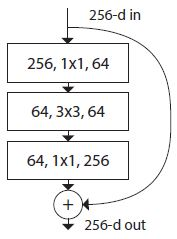
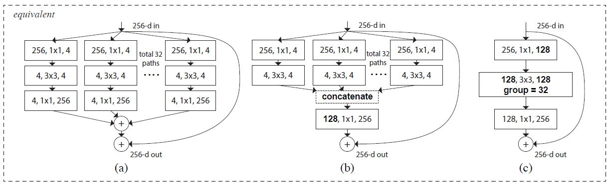
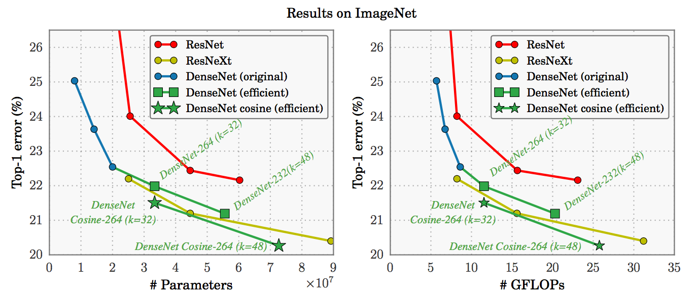

# ResNeXt-Tensorflow
Tensorflow implementation of [ResNeXt](https://arxiv.org/abs/1611.05431) using **Cifar10**

If you want to see the ***original author's code***, please refer to this [link](https://github.com/facebookresearch/ResNeXt)

## Requirements
* Tensorflow 1.x
* Python 3.x
* tflearn (If you are easy to use ***global average pooling***, you should install ***tflearn***)

## Issue
* If not enough GPU memory, Please edit the code
```python
with tf.Session() as sess : NO
with tf.Session(config=tf.ConfigProto(allow_soft_placement=True)) as sess : OK
```
## Compare Architecture
### ResNet


### ResNeXt


* I implemented (b) 
* (b) is ***split + transform(bottleneck) + concatenate + transition + merge***

## Idea
### What is the "split" ?
```python
  def split_layer(self, input_x, stride, layer_name):
      with tf.name_scope(layer_name) :
          layers_split = list()
          for i in range(cardinality) :
              splits = self.transform_layer(input_x, stride=stride, scope=layer_name + '_splitN_' + str(i))
              layers_split.append(splits)

          return Concatenation(layers_split)            
```
* ***Cardinality*** means how many times you want to split.

### What is the "transform" ?
```python
  def transform_layer(self, x, stride, scope):
      with tf.name_scope(scope) :
          x = conv_layer(x, filter=depth, kernel=[1,1], stride=stride, layer_name=scope+'_conv1')
          x = Batch_Normalization(x, training=self.training, scope=scope+'_batch1')
          x = Relu(x)

          x = conv_layer(x, filter=depth, kernel=[3,3], stride=1, layer_name=scope+'_conv2')
          x = Batch_Normalization(x, training=self.training, scope=scope+'_batch2')
          x = Relu(x)
          return x
```

### What is the "transition" ?
```python
  def transition_layer(self, x, out_dim, scope):
      with tf.name_scope(scope):
          x = conv_layer(x, filter=out_dim, kernel=[1,1], stride=1, layer_name=scope+'_conv1')
          x = Batch_Normalization(x, training=self.training, scope=scope+'_batch1')

          return x
````

## Comapre Results (ResNet, DenseNet, ResNeXt)


## Related works
* [DenseNet-Tensorflow](https://github.com/taki0112/Densenet-Tensorflow)
* [SENet-Tensorflow](https://github.com/taki0112/SENet-Tensorflow)
* [ResNet-Tensorflow](https://github.com/taki0112/ResNet-Tensorflow)

## References
* [Classification Datasets Results](http://rodrigob.github.io/are_we_there_yet/build/classification_datasets_results.html)

## Author
Junho Kim
